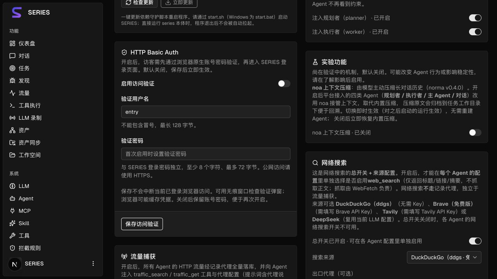

# HTTP 入口认证

## 在系统配置中设置

打开「系统配置 → HTTP Basic Auth」，填写验证用户名、验证密码，开启「启用访问验证」并点击「保存访问验证」。默认关闭；保存后立即生效，无需重启。旧环境变量开关已移除。

- 用户名默认为 `entry`，可修改；不能包含冒号或控制字符，最长 128 个 UTF-8 字节。
- 验证密码与 SERIES 登录密码独立，至少 8 个字符、最多 72 个 UTF-8 字节，不能包含控制字符。
- 首次启用必须设置密码。之后密码留空表示保留原密码；关闭时保留账号密码，便于重新开启。
- 配置保存在现有数据库 settings 表中，密码仅保存 bcrypt 哈希。读取接口只返回开关、用户名和是否已设密码。
- 保存失败时页面保留输入；数据库故障或损坏的配置返回 `503`，不会自动关闭保护。

其他浏览器先通过原生 Basic 认证，再进入系统登录页；Basic 不替代 JWT 登录。登录密码修改或 `reset-password.sh` 只影响系统登录，不修改独立的入口密码。

保存成功时，当前已登录浏览器收到 HttpOnly 续接 Cookie，绑定当前 JWT 和配置版本，保持访问。只有 JWT 或只有此 Cookie 都不能通过入口；退出登录、JWT 过期或再次保存配置后旧续接凭据失效。可用无痕窗口检查认证弹窗。浏览器可能缓存 Basic 凭据，系统退出不会清除浏览器的认证缓存。

## 保护范围与部署

入口保护整个 Go HTTP 服务，包括页面、静态资源、登录、初始化、健康检查、API、下载和 SSE 建连。缺失或错误凭据返回 `401` 及 `WWW-Authenticate`，以触发标准浏览器认证；不是 `403`。已连接的 SSE 不主动断开，重连时执行最新验证。

公网必须使用 HTTPS。推荐反向代理终止 TLS，后端绑定回环地址，Docker 端口映射为 `127.0.0.1:8787:8787`。Nginx 的 HTTPS server 可配置：

```nginx
location / {
    proxy_pass http://127.0.0.1:8787;
    proxy_http_version 1.1;
    proxy_set_header Host $host;
    proxy_set_header Authorization $http_authorization;
    proxy_set_header X-Series-Token $http_x_series_token;
    proxy_set_header X-Forwarded-Proto $scheme;
    proxy_buffering off;
    proxy_cache off;
    proxy_read_timeout 3600s;
}
```

页面、API、SSE 应使用同一 HTTPS 地址。不要把 `NEXT_PUBLIC_SSE_BASE` 指向其他源；启用后不开放开发 CORS。反向代理应透传认证头，禁止缓存受保护内容，不在日志记录认证头、Cookie 或 Token。此前已缓存到 CDN 的公开资源应清理。

纯 Mock、独立 Next.js 开发服务或直接提供静态文件的服务不受 Go 入口保护，不能用来判断公网入口是否安全。Mock 卡片仅模拟配置交互。

如遗忘入口密码且所有管理浏览器均无法访问，可由服务器管理员在停止对外访问后，通过数据库删除 settings 中键为 `auth.http_entry` 的单条配置，再登录系统重新设置；不要删除其他设置。此操作会关闭入口保护，不应在公开访问期间进行。

## API 与性能

设置接口为 `GET /api/settings/http-auth` 和 `PUT /api/settings/http-auth`；PUT 接受 `enabled`、`username`、`password`，要求系统 JWT，启用后还需通过入口保护。空密码保留现值。更新在事务中串行执行，失败不产生部分配置。

外部客户端使用 Basic 验证账号，同时以 `X-Series-Token` 提供业务 JWT：

```bash
# curl 交互询问入口密码；TOKEN 为已有系统 JWT
curl --user entry -H "X-Series-Token: $TOKEN" https://your-domain.example/api/tasks
```

JWT 读取顺序为 Bearer、`X-Series-Token`、`series_token` Cookie、SSE 的 `token` 查询参数；显式无效值不回退到其他来源。

每次请求读取当前配置；bcrypt 成功结果最多缓存 128 项、5 分钟，仅保存与密码哈希和用户名绑定的进程密钥摘要。相同凭据并发检查合并，bcrypt 并发最多 4 个；直接连接 IP 每分钟最多 10 次认证失败，窗口最多 1,024 项，超限返回 `429` 和 `Retry-After`。不信任客户端转发 IP，代理后流量按代理连接 IP 计数。

## 验证记录

独立测试库覆盖即时启停、独立账号、密码留空保留、改密失效、重启恢复、配置故障及当前浏览器续接。原生 Basic 弹窗曾被内置浏览器以 `ERR_BLOCKED_BY_CLIENT` 阻止，弹窗交互需要在正式浏览器中核验；HTTP challenge 与权限检查由后端回归验证。

本次验证（2026-10-09）：

- 独立 PostgreSQL 测试库：`go test -p 1 ./config ./server ./db` 通过，Server 约 63 秒、DB 约 115 秒。
- 认证及 JWT 针对性回归：`go test -race ./server -run 'TestHTTPEntry|TestJWTHeader' -count=1` 通过。覆盖非法配置不落库、续接 Cookie 防伪、JWT 过期、无效显式 Token 不回退、配置版本失效和静态资源 Cookie 认证。
- 全项目 Go 编译、含前端资源的 `embedui` 后端构建通过。
- 前端类型检查、36 项单元／Mock 测试、生产静态构建通过。
- 浏览器检查默认关闭状态、独立用户名／密码字段及保存按钮，未通过浏览器修改实际认证凭据。截图为 Mock 设置页，不表示已经启用后端保护。
- 未修改业务库、启用线上认证或重启业务服务。测试数据库验证后清理。


