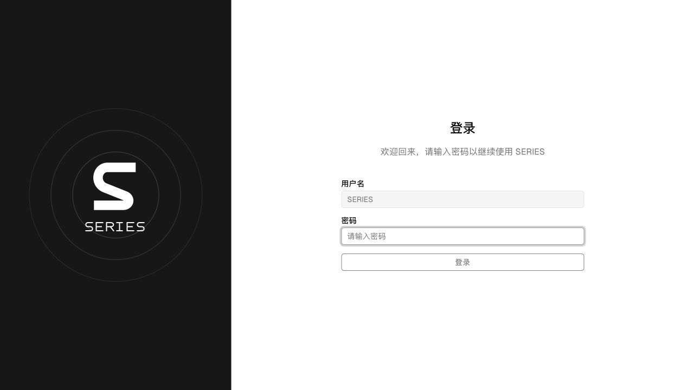
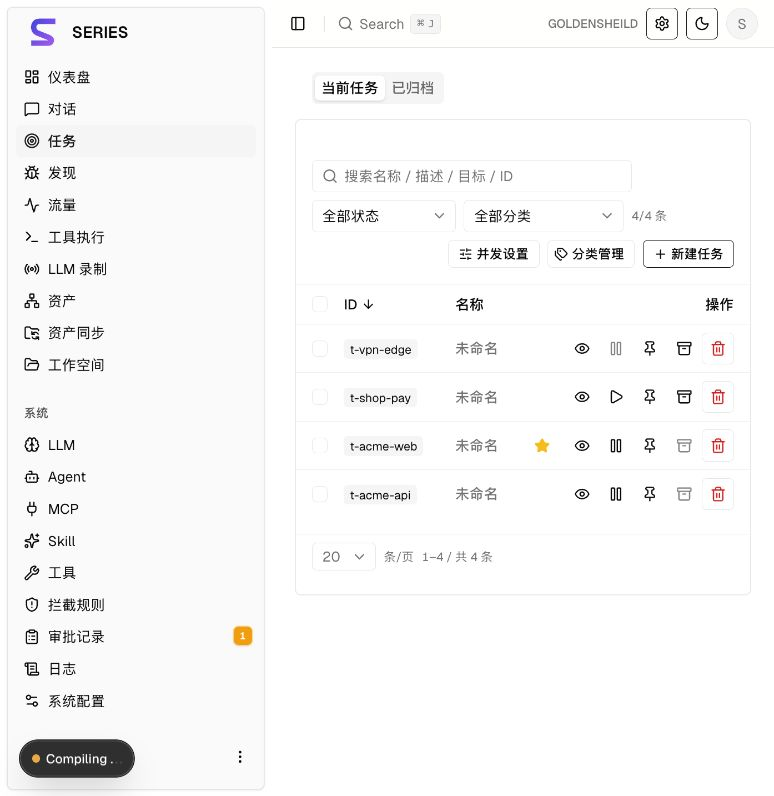
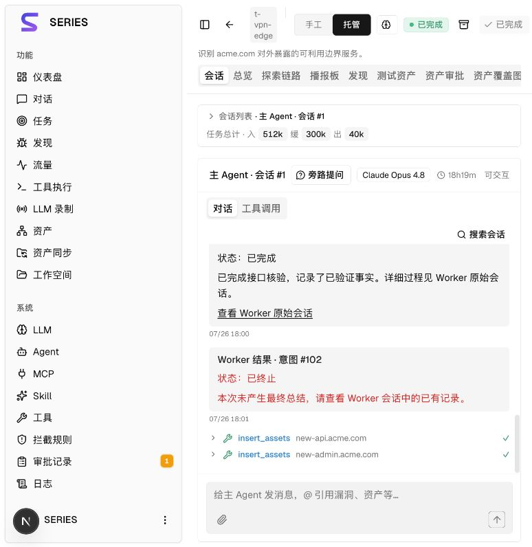
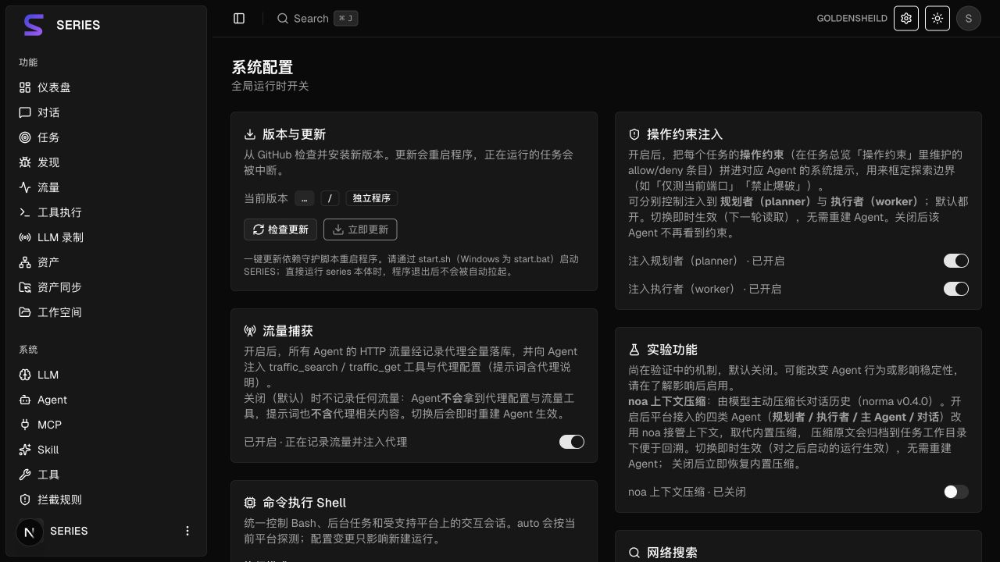

# SERIES 更名交付与切换说明

## 修改范围

- 备份引用：`codex/backup-before-series-20261009`，基点 `ad09c2eccea0571541b5c8613c25ccb0a462cf81`。
- 从该基点恢复原先删除的 248 个前端文件，随后统一更名；没有改写 Git 历史或业务数据。
- 产品名 `SERIES`，Go 模块 `github.com/neouks/series`，命令入口 `cmd/series`，前端包 `series-web`。
- 登录用户名与 JWT subject 为 `SERIES`；仅接受 HS256 和新 subject。密码哈希及签名密钥沿用现有保存值。
- Cookie 为 `series_token`，原项目专用的浏览器存储、事件及环境变量均改用新前缀，没有旧别名或自动偏好迁移。
- 资产登记事务及触发器统一使用 `series.*` 设置；每次启动的现有幂等 schema 更新会替换触发器函数。
- Worker 人工消息按完整注释记录与请求 ID 去重，兼容历史品牌标记，不改写原始消息。
- 保留本地 norma 依赖及其定制代码。角色授权、手工模式、异步下发、Worker 回传等业务逻辑保持原设计。
- 新增蓝紫 S 图标和 SERIES 字标，更新 SVG、PNG、ICO、登录页和侧栏；删除 28 张旧页面截图，保留历史验证文字结论。
- 仓库、发布源与更新器改为 `neouks/series`，移除旧演示站及无法映射的历史链接。没有正式发布包时继续返回明确错误。
- 本地 Docker 镜像默认 `series:local`；安装和更新通过 `build-docker.sh` 先生成 Linux 二进制及前端产物再构建镜像。镜像推送 job 已移除，二进制 Release job 保留并更名。

## 旧部署切换

1. 备份现有数据库、数据目录、`config.json`、`jwt.key` 和部署配置。
2. 将项目专用环境变量改成 `SERIES_` 前缀。常用项包括 `SERIES_CONFIG`、`SERIES_PG_DSN`、`SERIES_LLM_PROVIDER`、`SERIES_LLM_MODEL`、`SERIES_LLM_BASE_URL`、`SERIES_LLM_PROXY`。配置项值保持原值，特别是数据库名、用户名、密码、地址。
3. Docker 的 `POSTGRES_USER`、`POSTGRES_DB` 必须显式填写现有值。保留原 Compose project 名及 `pgdata` 卷关联，避免目录更名后创建一个空的新卷；保留原 `./data` 和 `./skills` 挂载目录。不执行 `down -v`。
4. 在停机前完成构建。Docker 构建需要 Go 1.26+、Node.js/npm、Docker Compose；运行 `./build-docker.sh`。本机部署运行 `./build.sh`。
5. **先停止旧后端，再启动新后端**，由新程序更新触发器。首次切换服务名时须用原部署配置或原容器 ID 停止旧服务；新版 `update.sh` 中的 `stop series` 仅负责后续 SERIES 更新，不能代替这一步。
6. 使用 `SERIES` 和原密码重新登录。旧 Token 失效，浏览器偏好按新键重新建立。

新部署示例默认数据库与用户名为 `series`。此默认值不代表会迁移、重命名或重建旧数据库。

## 验证记录

| 项目 | 结果 |
| --- | --- |
| Go 全项目 `go test -p 1 ./...` | 通过，14 个含测试包；使用独立 PostgreSQL 容器、55439 端口及专用测试 DSN |
| 本地 norma `go test ./...` | 通过，包括 llm、agentcore、noa、noaadapter、tool |
| 触发器启动更新 | 新增旧命名空间模拟测试通过，重开数据库后函数恢复为新事务命名空间；来源登记回归通过 |
| JWT 和 Worker 历史输入 | 新 subject、算法限制、缺失/其他 subject 拒绝，以及历史标记、精确请求 ID、消息不变回归通过 |
| 现有数据库/服务端回归 | 资产来源、审批、归档还原、Worker 回传及更新包提取/回滚相关测试随全量回归通过 |
| 前端类型检查 | `tsc --noEmit` 通过 |
| 前端与 Mock 测试 | 43/43 通过；并发构建期间轮询计时测试首次失败，串行复测全套通过，未修改轮询逻辑 |
| 静态生产构建 | `npm run build:static` 通过，356 个导出文件；内嵌目录通过 `rsync --delete` 同步，移除旧构建遗留 chunk |
| 发布构建 | Linux amd64/arm64、macOS amd64/arm64、Windows amd64 五种二进制和 ZIP 通过；名称、压缩包入口及校验文件已核对 |
| 启动检查 | macOS arm64 本机及 Linux amd64 临时无网络容器执行 `-h` 通过；其他架构仅完成交叉编译，未声称原生运行验证 |
| 脚本及 Compose | Bash/sh 语法检查、Compose 配置解析通过；未发布镜像或运行完整工具镜像安装 |
| 浏览器 | 生产登录页、Mock 任务/会话、设置和浅色/深色品牌显示通过，截图如下 |

测试用 `GOSUMDB=sum.golang.org` 覆盖本机关闭校验数据库的环境设置，以正常加载 Go 工具链。没有使用业务数据库或调用真实 LLM。

## 残留检查边界

对当前受控文件、将新增的交付文件和相对路径进行不区分大小写扫描，旧项目名匹配为零。前端导出目录和内嵌目录也为零。

对五种二进制逐项检查：没有旧品牌、旧模块路径或旧前端资源。原始字节子串扫描仍命中第三方 PostgreSQL 认证类型名，以及 Go 链接器拼接的相邻常量；这些不是项目名称。未改写第三方协议符号或破坏二进制来消除无关子串。发布包内的文件名均已更名。

Git 历史、`.git`、工作区根目录、业务数据与已有运行进程不属于替换范围。修改留在当前工作区，未推送、未正式发布、未重启业务服务。

## 新版截图

登录来自生产静态构建；任务、会话及设置来自 Mock，没有业务数据。

